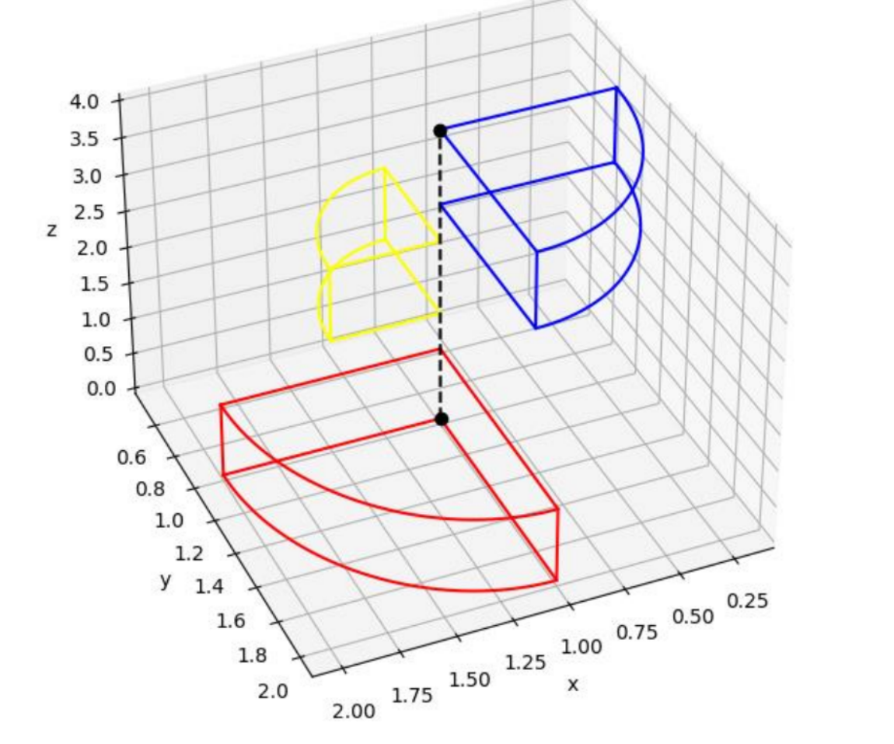
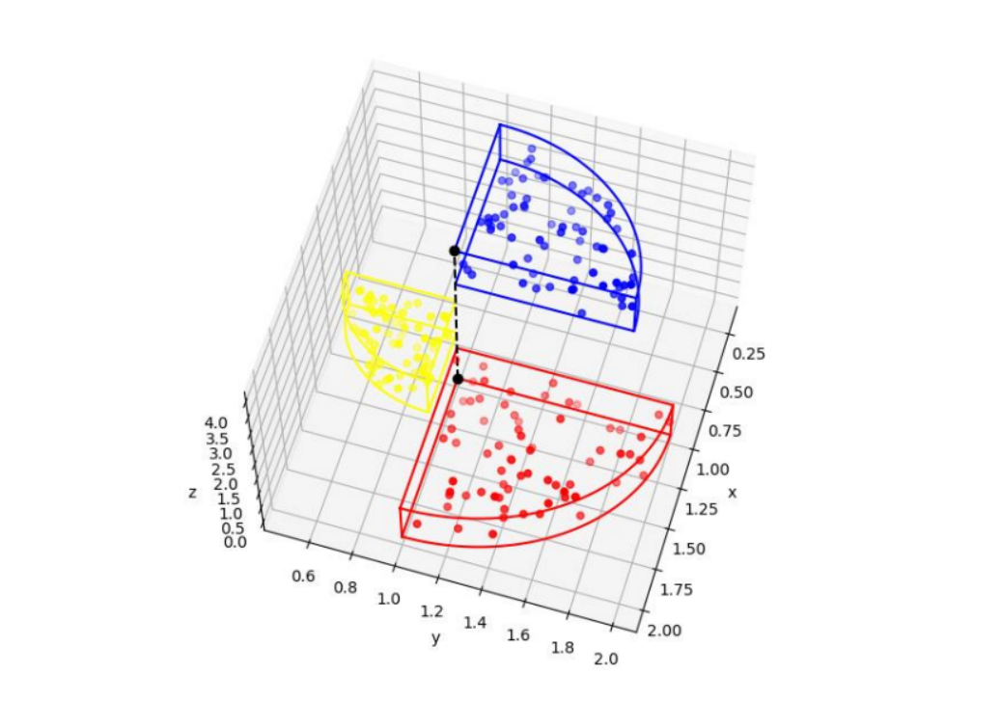
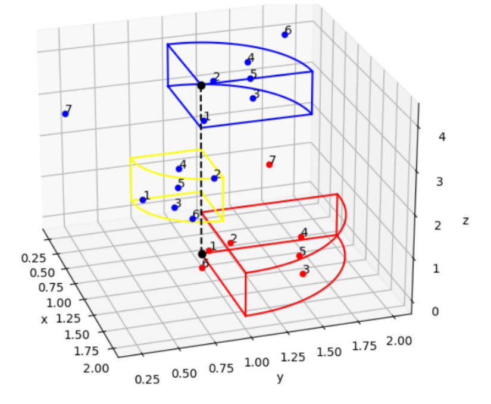
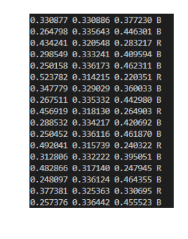

# 2022-3-2-Artificial_Intelligence
## 3학년 2학기 인공지능 수업
 

# 과제 1
## C 언어를 활용한 신경망 구현 (이를 그대로 파이썬으로도 구현)
3 x 3 순전파 (forward propagation) 을 C 언어로 구현

Output의 활성화 함수는 시그모이드 함수 $1/1+e^{-x}$ 를 사용한다.

시그모이드 함수의 분모에 있는 $e^{-x}$ 는 x 의 값이 커짐에 따라 작아지므로 
x 값이 커짐에 따라 시그모이드 함수의 결과값은 커지게 된다.

즉, input 의 값은 유지한 상태에서 가중치의 값을 늘려 Layer 에서 계산되는 값들이 커질 경우
Output 의 결과값이 커지는 것을 확인할 수 있었다.

 

# 과제 2
## C 언어를 활용한 신경망 구현과 파이썬을 통한 시각화로 3차원 공간 구분하기

3 x 3 순전파와 역전파 (Back proppagation) 을 C 언어로 구현

활성화 함수는 시그모이드 함수 $1/1+e^{-x}$를 사용한다.

은닉층 (Hidden Layer) 는 2개로 Chain Rule 을 통한 편미분을 사용하여 
C언어로 공식을 구현하여 역전파를 수행하고 가중치를 업데이트한다.

 

- 3차원 공간에서의 구분을 위한 각각 다른 반지름을 가진 구분되는 부채꼴 모양을 면으로 갖는 3개의 영역을 설계한다.

- 학습데이터로 사용할 xyz 의 좌표를 임의로 생성한다.

### 학습 결과

- 테스트 케이스를 통해 학습 결과를 확인한다.

- 왼쪽 부터 RGB 에 대한 예측 결과이고 그중 가장 높은 결과가 나온 값을 문자로 나타낸 것이다. 

5번의 학습을 통해서는 좌표를 통한 3개의 영역 구분이 되지 않았다는 확인할 수 있다.

결과값 또한 목표값인 1에 한참 미치치 못하는 결과를 보여주고 있으므로

이후 추가 과제에서 오차 함수를 확인하고 학습 횟수에 따른 변화를 확인하였다.

---
# 과제 2 - 추가 과제
