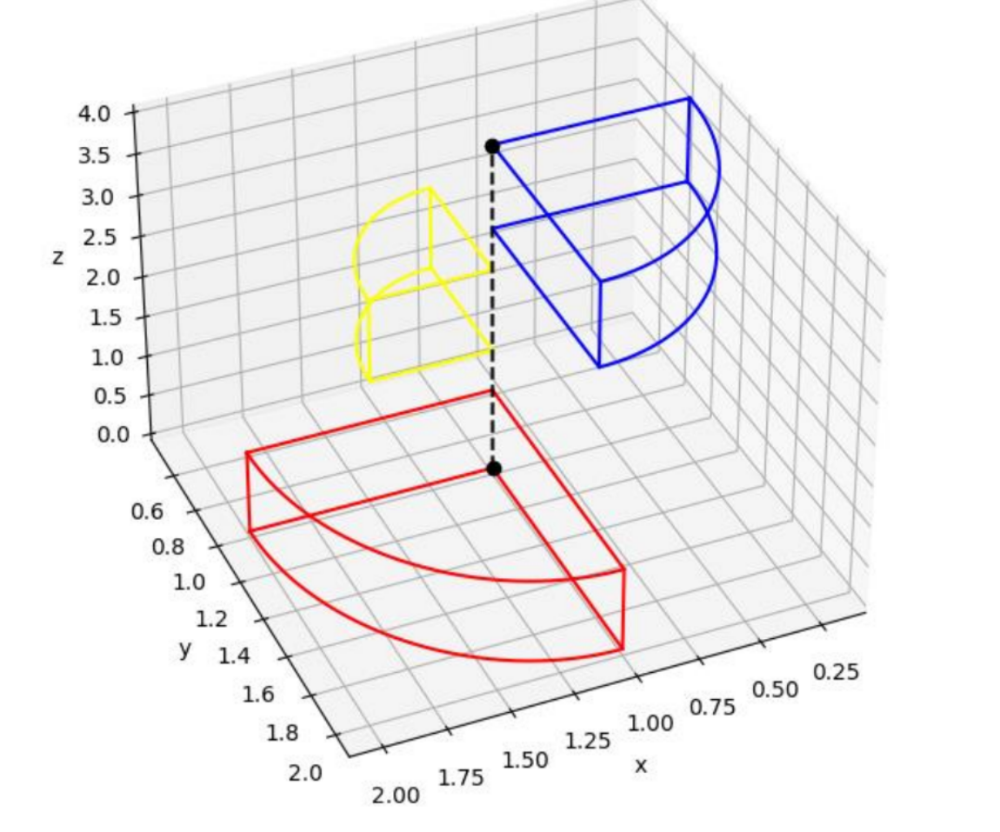
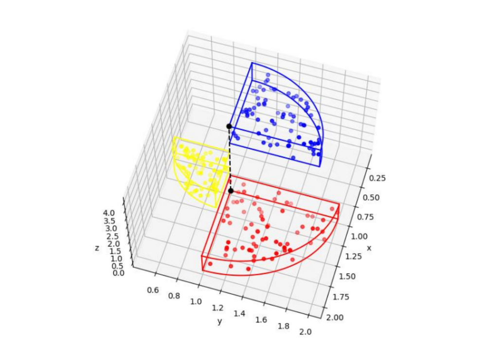
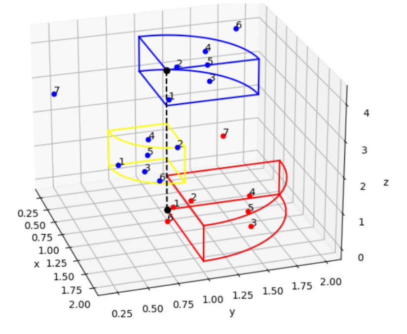
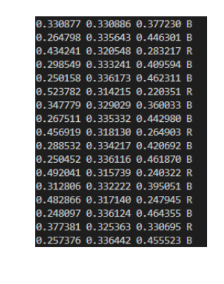
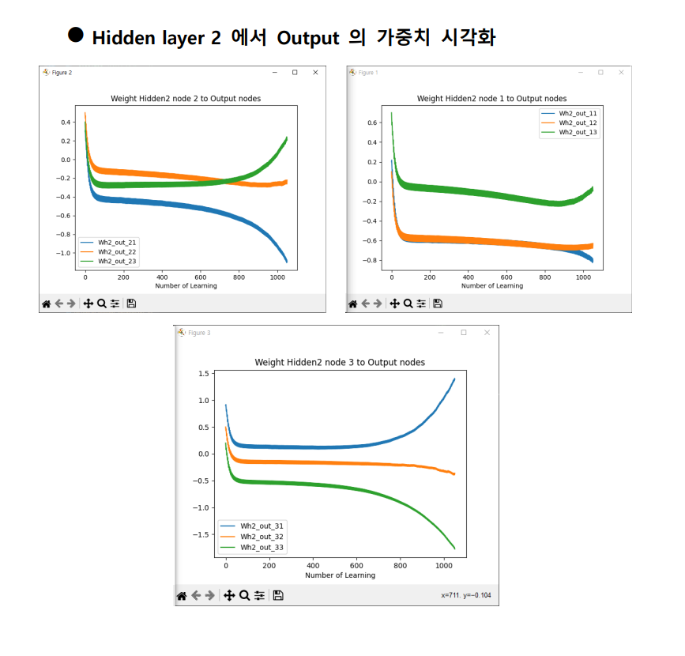
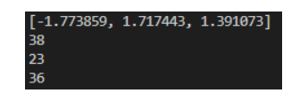
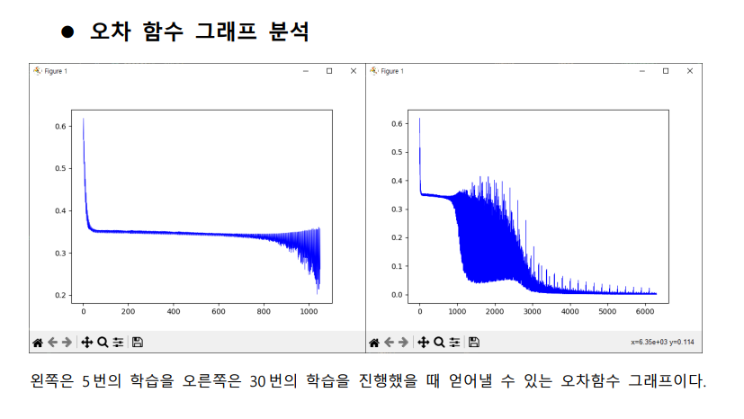
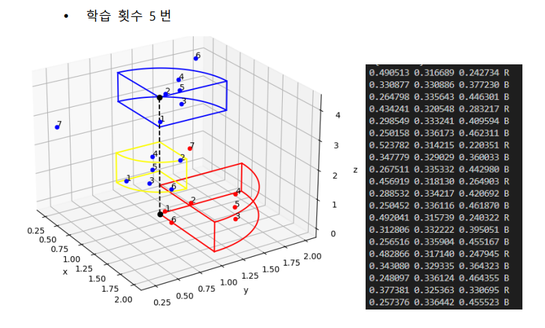
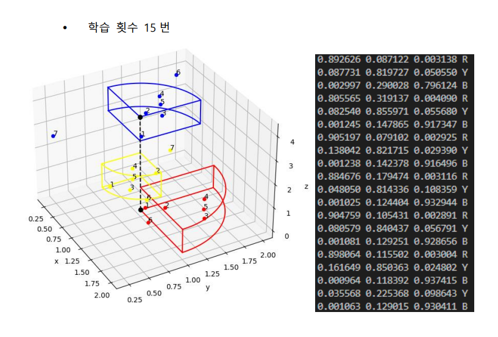

## 3학년 2학기 인공지능 수업

 

 

# 과제 1
## C 언어를 활용한 신경망 구현 (이를 그대로 파이썬으로도 구현)
3 x 3 순전파 (forward propagation) 을 C 언어로 구현

Output의 활성화 함수는 시그모이드 함수 $1/1+e^{-x}$ 를 사용한다.

시그모이드 함수의 분모에 있는 $e^{-x}$ 는 x 의 값이 커짐에 따라 작아지므로 
x 값이 커짐에 따라 시그모이드 함수의 결과값은 커지게 된다.

즉, input 의 값은 유지한 상태에서 가중치의 값을 늘려 Layer 에서 계산되는 값들이 커질 경우
Output 의 결과값이 커지는 것을 확인할 수 있었다.

 

# 과제 2
## C 언어를 활용한 신경망 구현과 파이썬을 통한 시각화로 3차원 공간 구분하기

3 x 3 순전파와 역전파 (Back proppagation) 을 C 언어로 구현

활성화 함수는 시그모이드 함수 $1/1+e^{-x}$를 사용한다.

은닉층 (Hidden Layer) 는 2개로 Chain Rule 을 통한 편미분을 사용하여 
C언어로 공식을 구현하여 역전파를 수행하고 가중치를 업데이트한다.

 

- 3차원 공간에서의 구분을 위한 각각 다른 반지름을 가진 구분되는 부채꼴 모양을 면으로 갖는 3개의 영역을 설계한다.

- 학습데이터로 사용할 xyz 의 좌표를 임의로 생성한다.

### 학습 결과

- 테스트 케이스를 통해 학습 결과를 확인한다.

- 왼쪽 부터 RGB 에 대한 예측 결과이고 그중 가장 높은 결과가 나온 값을 문자로 나타낸 것이다. 

5번의 학습을 통해서는 좌표를 통한 3개의 영역 구분이 되지 않았다는 확인할 수 있다.

결과값 또한 목표값인 1에 한참 미치치 못하는 결과를 보여주고 있으므로

이후 추가 과제에서 오차 함수를 확인하고 학습 횟수에 따른 변화를 확인하였다.

 

# 과제 2 - 추가 과제
## 가중치의 변화량을 분석하여 가장 영향이 큰 가중치와 최적의 학습 횟수 찾기

### 학습 중 영향이 가장 큰 가중치 찾기 
가중치의 변화량을 layer 별로 시각화하여 전체 가중치 중 최종 결과에 가장 영향을
많이 미치는 가중치를 구하고자 하였다.

가중치는 노드에 들어온 입력 값에 대해 영향을 줄 수 있는 요소로 해당 노드에 대한 가중치가
높을수록 결과값에 대한 해당 노드의 영향이 크다고 볼 수 있다.
 

이에 근거하여 전체 가중치 중 최종 결과가 가장 영향을 많이 미치는 가중치를 찾기 위해 가중치의 절대값이 가장 큰 3개를 찾아보았다.

또한 이는 학습 데이터의 순서와 학습 데이터를 바꾸어 보았지만

절대값이 가장 큰 가중치들은 크게 변하지 않았다는 것으로

입력 데이터 또한 일정한 범위 안의 랜덤 상수에서 생성되며,
역전파 알고리즘과 초기에 설정된 랜덤한 가중치의 초기값으로 인해

가중치는 크게 변하지 않는다는 것을 알 수 있었다.

 

### 최적의 학습 횟수 찾기
그 다음으로 오차 함수 그래프를 분석하여 최적의 학습 횟수를 찾고자 하였다.

5번의 학습으로는 아직 오차가 0.2 ~ 0.4 로 나타나지만
30번의 학습을 통해서는 3000번 즉, 210(학습 데이터) x 에폭 15 = 3000, 15번의 학습 이후에는  수렴하는 모습을 보이고 있다.

즉, 오차 함수가 0에 가까워진 채로 수렴하는 것으로 이는 데이터를 목표에
맞게 잘 분류한다는 것이다.

이를 시각화하여 확인할 결과 학습 횟수를 15번으로 늘린 경우가 기존의
5번에 비해 더 데이터를 영역에 맞게 잘 분류하는 것을 확인할 수 있었다.

---
### 수강 이후 느낀 점 (4학년 1학기)
인공지능 과목을 수행하고 과제와 프로젝트를 정리하면서 완전히 개념이 정리되지 않고
과제와 프로젝트의 완성을 목표로 하다보니 결과에 영향을 줄 수 있는 영향과 원인들을
제대로 고민하거나 고려하지 않은 채로 진행한 것 같다는 느낌을 받았다.

(테스트 케이스를 따로 준비하지 않고 진행하여 과적합이 된 경우나,
단순히 수치로 나온 결과로만 판단하여 결론을 짓거나)

인공지능에 대한 공부를 더욱 진행하면서 이전에 내가 했던 과제와 프로젝트들을
돌아보며 잘못된 점이나 수정하고 다시 생각해보야 할 부분을 바라볼 필요가 있다고 생각했다.